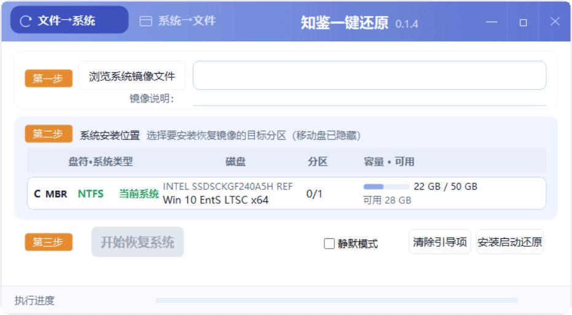

# SysRecover（九转还原 · 单机版）

> [中文](README.md) | **English**

> 版本 `0.4.1`｜**x64 + x86 双架构**（Windows 侧跟随系统位数，Linux 救援层固定 x64）｜Windows 7 / 10 / 11 / WinPE｜发布包 ≈47 MB（其中 ≈90% 是救援层）
> 许可：自有代码 **MIT**（见 [`LICENSE`](LICENSE)）；第三方组件「单独分发」，清单、全文与源码出处见 [`THIRD_PARTY_LICENSES.txt`](THIRD_PARTY_LICENSES.txt)

一句话：**把 Windows 系统备份成一个镜像文件，需要的时候一键还原回去。**

备份/还原这类工具街上不少，所以我们把话说在前面：**这个项目是怎么做的、做到了哪一步、
哪儿还不行**，下面全写清楚，不夸张。

> ⚠️ 本仓库是**独立产品（单机版）**。早期的 `WooMonlee/OnekeyRestore`（C# + VHDX 多点秒还原）
> 是**另一个产品**，两边设计与实现分开推进、文档不混用。
>
> 👋 **第一次进来先看 [`docs/11-接手指南（读我优先）`](docs/11-接手指南（读我优先）.md)** ——
> 现状（已验证/待验证）、下一步优先级、文档地图；想先了解产品再看 [`docs/00-项目简介`](docs/00-项目简介（给协作者）.md)。



<sub>主界面（还原模式）：**第一步**选镜像 → **第二步**选目标分区（脏盘会标出"当前系统"）→ **第三步**开始恢复；
右上角显示程序版本号，底部是执行进度。</sub>

---

## 一、它是什么，以及它**不是**什么

**是**：系统备份（热备 VSS）→ 系统还原（选镜像 + 选目标分区 → 一键回滚）。

**不是**（先把边界划清楚，免得各位拿它去干别的活）：

| 不做 | 说明 |
|---|---|
| 分区管理 / 调整分区 / 克隆磁盘 | 我们不做磁盘工具，只处理"把系统写回去"这件事 |
| 数据恢复 | 不做 |
| **多点还原 / 差分秒还原** | 这条产品线**没有**，也不打算加（那是另一个产品线的事） |
| **32 位系统** | ✅ **支持**：Windows 侧**跟随系统位数**（32 位系统跑 x86、64 位系统跑 x64），发布包根目录的启动器自动选；**Linux 救援层固定 x64** |
| **Windows 2003 / XP / Vista 及更早** | ✗ **不支持**（UCRT 最低 Vista SP2 / Win7 SP1+；见「已知限制」）|

---

## 二、为什么还要再写一个

因为实际干活时会碰上这几件事，而很多工具在这几件事上会翻车：

1. **阵列卡 / 服务器机器上，救援环境认不到硬盘** —— 很多 PE 的驱动覆盖不到 RAID 卡。
   → 我们的救援层是完整 Linux 内核 + **494 个存储/文件系统模块**（`megaraid_sas`/`mpt3sas`/`isci`/`vmd`/`hpsa`/
   `aacraid`/`arcmsr`/`pm80xx`/`mvsas`/`lpfc`/`qla2xxx`/`virtio_scsi`… 都在），阵列卡机器上照样能干活。
2. **还得准备 U 盘 / PE 启动盘** —— 多一道工序，也多一个出错的地方。
   → 救援层**内置在软件里**，部署一次，之后一条链走到底。
3. **Secure Boot 机器上要进 BIOS 关安全启动**（部分同类工具就是这样要求的）。
   → 我们走**微软签名链**（下面 §4 详述），用户**不用关、也不用注册任何密钥**。
4. **还原"成功"了但开不了机** —— 万能镜像缺引导文件、NTFS 引导区不全、BCD 里还写着旧盘符……
   → 这些**我们替用户做完了**（§5）。
5. **拿到一个上次没写完的半截镜像，还原到一半黑屏。**
   → 我们**先校验再动手**，镜像不完整**直接拒绝**，不给你"赌一把"的机会。

---

## 三、怎么工作的

```
┌─────────── Windows 侧（SysRecover.exe / SysRecoverUI.exe）──────────┐
│  list / diag   看现场（只读）                                        │
│  backup        VSS 热备 → 写 WIM/ESD（先写 <目标>.tmp，成功才改名）  │
│  restore       安全四检查 → 镜像可用性校验 → 二选一：                │
│                   ├─ 就地还原：格式化 + apply + bcdboot → 不重启      │
│                   └─ 重启还原：暂存任务 + 配引导 → 重启              │
└──────────────────────────────┬──────────────────────────────────────┘
                               ↓ 重启（仅"还原系统盘"这条路）
┌──────────── 内置 Linux 救援层（vmlinuz + initramfs + restore 脚本）─┐
│  加载存储模块 → 找目标分区与镜像 → 格式化 → apply → 修引导 → 重启   │
└─────────────────────────────────────────────────────────────────────┘
```

- CLI 与 GUI **共用同一套 `app` 层代码**，行为一致（不是两套实现）。
- 救援层的日志会写到**软件目录的 `logs/`**（成功也保留），出问题让用户把那个文件夹发回来即可。

---

## 四、三条引导链（细节见 [`AGENTS.md` §7](AGENTS.md)）

| 固件/模式 | 链路 |
|---|---|
| **BIOS / MBR** | `MBR → bootmgr → BCD（实模式启动扇区 → \grldr.mbr）→ \grldr → \menu.lst → 内核 + initramfs` |
| **UEFI（Secure Boot 关）** | 直接写**固件启动项**（NVRAM `Boot####`），由固件加载内核，命令行走 `OptionalData` |
| **UEFI + Secure Boot 开** | `固件 → shimx64.efi（**微软双签 CA2011+CA2023**）→ grubx64.efi（**Debian 签名**的 GRUB）→ Debian 签名内核 + 我们的 initramfs` |

关于最后一条：它**没有绕过任何机制** —— 链上每个可执行文件都有合法签名，和 Debian 正常开机走的是同一条路。
所以**不需要用户注册 MOK、也不需要关闭 Secure Boot**。shim 为 **CA2011+CA2023 双签**，覆盖 2026 新固件。

---

## 五、可靠性设计（为什么它不容易把事办砸）

| 机制 | 做法 |
|---|---|
| **写镜像不怕中断** | 先写 `<目标>.tmp`，成功才改名；中断只会留下临时文件，**原镜像不受影响** |
| **不接受坏镜像** | 动手前检查镜像是否"写入完成"（带 `WRITE_IN_PROGRESS` 标志/完整性不过 → 拒绝） |
| **不会抹错盘** | 四元素校验（GUID/磁盘序列号/偏移/大小）；**还原四检查**：目标是 ESP、BitLocker、恢复分区、或镜像文件就在目标分区内 → **任一命中直接拒绝**（退出码 4） |
| **不碰 MBR** | 只格式化目标分区；救援文件放目标分区；**数据盘根目录零新增** |
| **还原后能开机** | 写回完整 NTFS 引导区（扇区 0 的 426B + 扇区 1..8）；补 `\bootmgr` + `C:\Boot\BCD`；BCD 用 `device boot`（与盘符/磁盘号无关） |
| **任务能中止** | 备份/还原中点关闭 → 可选「终止并退出」，1 秒内收手，并删掉未写完的临时文件 |
| **失败必留证**（0.6.22+） | 救援层"黑匣子"：每个可挂载分区根 + ESP 都写 `ZJRESTORE-status.txt`（结果+步骤）、完整日志、**逐设备探测表**（mount 结果/错误原文/PCI 控制器/DMI）；软件目录找不到时也认领兜底日志窝 |
| **开机即报**（0.6.29+） | 下次启动自动读回执并提示"上次还原失败在第 X 步"；"暂存了但救援从未执行"（引导失败断电）也会提示 |
| **不会被旧契约带偏**（0.6.27+） | 暂存前清掉各盘根的旧 `_zjresy`/`restore-task*`；救援层只认 offset 与目标分区实际起始一致的那份 |
| **部署后校验**（0.6.27+） | 引导/救援文件落盘后逐文件 CRC32 比对，不一致即暂存失败；盘上留 `rescue-build.txt` 版本戳 |

---

## 六、支持矩阵（**实测过的**和**没测的**分开写）

| 场景 | 状态 |
|---|---|
| BIOS / MBR 全链还原 | ✅ 2026-09-19 实测（用户真机/VM） |
| UEFI / GPT 全链还原（Secure Boot 关） | ✅ 2026-09-19 实测 |
| UEFI / GPT + **Secure Boot 开**（零注册零交互，Debian 双签链） | ✅ 2026-09-19/09-23 实测 |
| 热备份（VSS）→ 还原后正常进系统 | ✅ 2026-09-19 实测 |
| **Win7 宿主**（装 VC++ 运行库后）运行工具 | ✅ 2026-09-20 实测 |
| **Win7 宿主还原 Win10 镜像**（跨系统版本） | ✅ 2026-09-20 实测，还原后正常启动 |
| 阵列卡/RAID 驱动入包（Debian 内核，关键 HBA 全覆盖）| ✅ QEMU 实测加载成功（**真机待验**）|
| QEMU 自动回归（UEFI 起救援、屏显、PBR 探针、BIOS/GRUB4DOS、全流程演练…）| ✅ 见 [`docs/07`](docs/07-测试矩阵与回归记录.md) |
| **救援层模块裁剪**（779→494，dist 54→39MB）后的完整回归 | ✅ 2026-09-24 实测（含端到端还原演练，PIT-079/080） |
| **三盘客户机全真复刻**（MBR+扩展分区+GPT；成功/失败/假契约/挂盘失败）| ✅ 2026-10-04 实测（PIT-112/113/114）|
| **真实镜像压测**（Win10 7.57G / Win11 43.35G + ESP）| ✅ 8G 全程通过；512MB 正常、192MB OOM 但完整留证（PIT-113）|
| **PE / 非系统盘「就地还原」（不重启）** | 🚧 **待实测**（代码已就绪，验收清单见 [`docs/09`](docs/09-PE直装验收清单.md)） |
| **忙时关闭「终止并退出」** | 🚧 **待实测** |
| **Win7 零安装** | 🚧 真机待验（UCRT 已随包 x64/x86）|
| 服务器 RAID **真机**、只信 CA2023 的 2026 新固件 | 🚧 待验（机制已就绪）|
| 32 位系统（Win7/Win10 x86）| ✅ **已支持**：随包双架构，根目录启动器自动选；32 位程序在 64 位系统上会自举成 `x64\` 那份（见 [`docs/08`](docs/08-32位支持（评估与实现）.md)） |

> 表里写 🚧 的，就**别当它已经能用** —— 这是我们自己定的规矩：没真跑通不写 ✅。

---

## 七、上手：普通用户（GUI）

1. 解压发布包，**双击 `SysRecoverUI.exe`**（会弹一次 UAC，因为要读写分区/引导）。
2. **备份**：切到「系统→文件」→ 选保存位置 → 点「开始备份系统」。
3. **还原**：切到「文件→系统」→ 选镜像（也可以**直接把 .esd/.wim 拖进窗口**）→ 选目标分区 →
   点「开始恢复系统」→ 选「退出并重启」→ 之后全自动，最后自动回到新系统。
   - 想批量/无人值守就勾上 **`静默模式`**：全程无对话框，直接干完。

---

## 八、命令行用法

> CLI 与 GUI 共用同一套 `app` 层代码，行为一致。
> CLI 也编入了 `requireAdministrator` 清单：在**管理员命令行 / 计划任务（最高权限）/ PsExec `-s` / SCCM**
> 这类上下文里本就处于高完整性，**全程静默不弹 UAC**（机房批量部署走的就是这条路）。
>
> 全部命令随时可查：`SysRecover.exe help`；单项帮助 `SysRecover.exe help backup`。
> 另有 `repair-boot`（引导坏了不用重装）、`history`（操作历史）等命令。

**路径写法（`\` 与 `/` 的分工）**：

- Windows 文件/目录参数（`--dest`、`--image`、`--file`、输出目录）用**反斜杠** `\`：`D:\backup\win10.esd`
- `--source` 盘符根：`C:`、`C:\`、`C:/` **三种写法均可**（程序自动归一化成 `C:/`）
- `--path` 镜像内路径：Windows 风格、**以 `\` 开头**，支持通配符

先看现场（只读，随时能用）：

```cmd
SysRecover.exe list
SysRecover.exe diag
```

- `list`：磁盘 / 分区 / 文件系统 / 盘符 / ESP / 系统标记
- `diag`：固件类型、Secure Boot 状态、启动项是否已装、wimlib 自检；加 `--zip` 导出诊断包（diag 文本 + `logs/` + 契约文件），方便反馈问题

### 案例 1 · 把当前系统热备成镜像

```cmd
SysRecover.exe backup --dest D:\backup\win10-20260920.esd --source C: --compress recovery --verify --name "Win10 出厂态" --esp
```

- `--source C:`：盘符根 → 自动走 VSS 热备（VSS 快照 + 排除清单）；`C:` 或 `C:/` 均可
- `--compress`：`recovery`（.esd 最省）/ `maximum` / `fast`
- `--verify` 写完立即校验；`--name` 指定子镜像名
- `--esp`：把 ESP 分区并入**同一镜像**（第二个子镜像，名为 ESP），还原系统时**自动恢复回 ESP**；本机没有 ESP 时自动跳过
- 目标已存在需 `--yes` 覆盖，或用 `--append` 追加为同一 WIM 里的新子镜像
- 辅助命令：`images --file <镜像>` 列子镜像（含大小与描述）；`verify --image <镜像>` 单独校验
- **从镜像里取单个文件**（不用整盘还原，先看看里面有什么 / 只捞一个文档出来）：

  ```cmd
  SysRecover.exe extract --file D:\backup\win10.esd --index 1 --path "\Users\*\Desktop\*.docx" --dest D:\out
  ```

  `--path` 可重复，支持通配符；文件按镜像里的目录层级落到 `--dest` 下。

### 案例 2 · 还原一个万能镜像到 C 盘

先确认磁盘号 / 分区号：

```cmd
SysRecover.exe list
```

执行还原（`--yes` **必填** = 确认覆盖目标分区）：

```cmd
SysRecover.exe restore --image D:\backup\wannei-win10.esd --disk 0 --part 3 --index 1 --yes
```

执行方式**自动二选一**：

| 情形 | 行为 |
|---|---|
| 目标是**正在运行的系统盘** | 暂存任务 → **重启**进内置救援层 → 格式化 + 应用 + 修引导 → 自动重启回新系统 |
| 目标**未被占用**（在 **PE** 里、或还原到**非系统盘**） | **就地还原**：格式化 + 应用 + `bcdboot` → **完成，不重启** |

- `--index N` 指定子镜像；`--no-repair-boot` 不自动修引导
- 镜像里若带 **ESP 子镜像**（备份时加了 `--esp`），还原系统时**自动**把 ESP 一并恢复，无需额外参数
- 镜像必须放在**本地分区**：重启后的救援层访问不到网络（UNC / 映射盘）
- 退出码：`0` 成功 / `1` 通用失败 / `2` 参数错 / `3` 需管理员 / `4` 危险目标被拒 / `5` 镜像校验失败 / `6` 取消

### 案例 3 · 做"无人参与的静默还原"入口

思路：把还原任务**暂存**下来（并装好常驻引导模块），之后由**开机菜单**或**单次启动**触发，全自动完成。

1. （推荐）先用 GUI 的「安装启动还原」装一次常驻引导模块（UEFI：写固件启动项；BIOS：BCD 实模式启动扇区条目）。
2. 暂存一次静默还原：安检 → 镜像可用性校验 → 写契约 → 刷新引导层 → 设单次启动：

   ```cmd
   SysRecover.exe restore --image D:\backup\wannei-win10.esd --disk 0 --part 3 --index 1 --yes
   ```

3. 重启，此后无需任何操作：

   ```cmd
   shutdown /r /t 0
   ```

- **单次语义**：那条"单次启动"用完即消，平时开机照常进 Windows。
- **常驻语义（UEFI）**：固件启动项挂在 `BootOrder` 末尾，开机启动菜单里随时能选；
  任务契约放在**数据盘**（不被格式化），所以之后再选它还会再还原一次 —— 就是"菜单里常驻的一键还原"。
- ⚠️ **BIOS 下不常驻**：救援文件随目标分区一起被格式化，那条菜单项**只对当次有效**；要常驻请用 UEFI。
---

## 九、构建（给想自己编的人）

```bash
mingw32-make -f Makefile package        # ★ 发布包 → dist/（根=x86 整套 + x64/ + 共享资源）
mingw32-make -f Makefile all            # 仅 x64 构建 → dist/x64
mingw32-make -f Makefile ARCH=x86 all   # 仅 x86 构建 → dist（根目录）
mingw32-make -f Makefile check          # 单元测试（纯逻辑，零依赖）
mingw32-make -f Makefile clean
```

- 工具链：**x64 = MinGW-w64 GCC 14.2**（`mingw64`）、**x86 = winlibs i686 UCRT GCC 14.2**（`mingw32`）；
  `package` 需要两套（x64 走 PATH 上的 `g++`，x86 走 `Makefile` 里写死的绝对路径）。
- 救援层组装：`tools/build-debian-rescue.py`（**Debian 签名内核 + 签名模块** + Alpine 用户态）
- 回归测试：`tools/vmtest/*.ps1`（UEFI/SB、BIOS/GRUB4DOS、屏显、固件直启…）+ `mk-drill.py`/`run-drill.ps1`（端到端还原演练）；清单见 [`docs/07`](docs/07-测试矩阵与回归记录.md)
- 换机器/换环境：见 [`docs/10-新环境交接说明`](docs/10-新环境交接说明.md)

### 发布包内容（`dist/`，约 46 MB）

```
SysRecover.exe / SysRecoverUI.exe   # x86 整套（入口）：真程序 + libwim-15.dll + x86 UCRT
x64/{SysRecover.exe, SysRecoverUI.exe, libwim-15.dll, UCRT(16)}
bootfiles/{grldr, grldr.mbr, vmlinuz-zjrestore, initramfs-zjrestore.cpio.gz, zjrestore-lite.sh}
bootfiles/sb/{shimx64.efi, grubx64.efi, grub.cfg}         # Secure Boot 链（x64，与宿主位数无关）
skin/ resources/ version.json THIRD_PARTY_LICENSES.txt
```

> **位数策略**：Windows 侧**跟随系统位数**（32 位系统跑 x86、64 位系统跑 x64，主要为备份压缩速度）——
> 根目录是 x86 整套，32 位程序在 64 位系统上会**自动把自己换成 `x64\` 那份**（`src/common/selfarch.cpp`），
> 所以**不需要独立启动器**。**Linux 救援层固定 x86_64**（与宿主位数无关）。详见 [`docs/08`](docs/08-32位支持（评估与实现）.md) §0。

---

## 十、已知限制与待验证

- **32 位 Windows**：已支持（Windows 侧跟随系统位数；发布包启动器自动选）。**Win7 x86 真机实测待做**；
  代价：32 位系统上备份压缩比 64 位慢（`fast`≈0~10%、`recovery`≈20~35%），**还原 0%**。见 [`docs/08`](docs/08-32位支持（评估与实现）.md) §0。
- **2026 新硬件 Secure Boot**：已换 **Debian 双签 shim（CA2011+CA2023）**，覆盖"只信新证书（CA2023）的
  2026 新固件"（Ubuntu 单签做不到）。机制见 [`PLAN.md` §11.1](PLAN.md)。用户 VMware（SB 开）实测还原成功 ✓，
  "只信 CA2023 的新固件"仍**待真机验证**。
- **Windows 7 零安装**：exe 与 `libwim-15.dll` 依赖 **UCRT**（Win7 无内置）→ 发布包**已随带 x64/x86 两套 UCRT**
  （`third_party/ucrt/{x64,x86}`，`make package` 自动分发），Win7 无需另装 VC++ 运行库。
- **Windows 2003 / XP / Vista 及更早版本不支持**（含 Server 2003）：exe 依赖 **UCRT**（微软 UCRT 可再发行仅覆盖
  Vista SP2 / Win7 SP1+ / Server 2008 R2 SP1+，**不含 2003/XP**），且官方 `libwim-15.dll` 也依赖 UCRT。
  实测 Win2003 报 `找不到 api-ms-win-core-errorhandling-l1-1-0.dll`。产品支持矩阵为 **Win7 / Win10 / Win11 / WinPE**。
- **ReFS 卷不支持**（与上一条同级别的硬限制，只写文档、不加运行时拦截）：
  **镜像文件不要放在 ReFS 分区上** —— 重启还原跑在 Linux 救援层，而救援层**没有 ReFS 驱动**
  （initramfs 里无 `refs`/`refs3` 模块，`parse-initramfs.py list` 实测为空），执行 apply 时读不到镜像、
  还原失败，**此时目标分区可能已被快格**（代价很大）。**目标分区也不支持 ReFS**（ReFS 本就做不了
  Windows 启动卷，且 `_zjresy*.log` 契约写在目标根、救援层同样读不到 → 任务发现阶段即停）。
  **做法**：镜像统一放 **NTFS**（FAT32/exFAT 数据分区也可作镜像盘）。就地还原路径由 Windows 自己读写，
  不受此限；产品支持矩阵照旧 **NTFS 系统卷**。
- **Win7 作目标 + UEFI 固件不稳**：Win7 的 UEFI 支持本身很弱，且 UEFI 还原时我们**不重刷 ESP 上的引导文件版本**
  （救援层在 Linux，跑不了 `bcdboot`）→ 实测在"按 Win10 配的 UEFI VM"里还原 Win7 会出现**引导循环**。
  **建议 Win7 目标走 BIOS/MBR**（Win7 的主流形态）。已列入待办（见 `docs/14` §3：还原后首次启动刷 `bcdboot`）。
- **PE 就地还原 / RAID 真机 / 忙时关闭**：代码已就绪，**待实测**（[`docs/11` §3](docs/11-接手指南（读我优先）.md) 有清单）。
- **救援层内存下限**：实测 **512MB** 可完整还原 43GB 镜像；**192MB 会在 apply 尾段被 OOM 杀掉**（失败也会完整留证，且 `<400MB` 会提前在屏幕/日志里 WARN）。救援环境建议 ≥1GB。
- `ZJ_ENABLE_MOK_PATH`（备选线：我们自签的 UKI + MOK 注册）默认**不编译、不随包**
  （`src/boot/uefi.cpp` 里改成 1 可启用）。

---

## 十一、许可与第三方

- **自有代码：MIT 许可**（见 [`LICENSE`](LICENSE)）—— 覆盖 `src/`、`skin/`、`tools/`、`tests/` 与为本项目编写的构建文件；
  欢迎学习、修改、再分发（保留版权声明即可）。
- 本产品自身代码**未静态链接任何 GPL 组件、未修改任何第三方源码**（`libwim-15.dll` 为 **LGPL 动态链接**，
  其余为「单独分发」的聚合）→ 不受 copyleft 的衍生作品条款约束。
- 第三方组件（Debian 内核与内核模块、GRUB、shim、GRUB4DOS、busybox、musl、ntfs-3g、util-linux、
  wimlib、Duilib、UCRT…）各自遵循其原有许可。**全部为未修改的上游发行版二进制**，其源码获取方式
  （Debian pool / Alpine CDN / wimlib 官网 / GRUB4DOS 官方发布页）见
  [`THIRD_PARTY_LICENSES.txt`](THIRD_PARTY_LICENSES.txt)「三、第三方源码获取方式」（该文件随包分发）。
- 构建/测试期工具（MinGW-w64、osslsigncode、QEMU/OVMF、mtools）**不随产品分发**。

---

## 十二、文档地图

| 文档 | 内容 |
|---|---|
| [`docs/11-接手指南（读我优先）`](docs/11-接手指南（读我优先）.md) | **先读这个**：现状、下一步、文档地图 |
| [`docs/00`](docs/00-项目简介（给协作者）.md)…[`docs/10`](docs/10-新环境交接说明.md) | 需求/架构/引导设计/跨层契约/磁盘与安全/构建合规/测试矩阵/32位评估/PE 验收/新环境 |
| [`docs/12-相对优势与竞品对比`](docs/12-相对优势与竞品对比.md) | 和同类工具比，我们好在哪、差在哪（含对客户的话术、含 Image for Windows 专节） |
| [`docs/13-开源同类调研（Clonezilla-Rescuezilla-FOG）`](docs/13-开源同类调研（Clonezilla-Rescuezilla-FOG）.md) | 开源同类（Clonezilla / Rescuezilla / FOG）调研 |
| [`docs/14-成熟技术借鉴（可靠性机制调研）`](docs/14-成熟技术借鉴（可靠性机制调研）.md) | Windows `recoverysequence` / Android A/B / RAUC 等成熟可靠性机制，我们已在用哪些、建议学哪些 |
| [`AGENTS.md`](AGENTS.md) | 操作手册：§0 五条红线、§7 引导 SOP、**§13 坑位册（PIT-001~117）**、§18 国际化纪律 |
| [`PLAN.md`](PLAN.md) | 路线图、版本号规则、待决事项 |
| [`LICENSE`](LICENSE) / [`THIRD_PARTY_LICENSES.txt`](THIRD_PARTY_LICENSES.txt) | 自有代码 MIT；第三方组件清单、全文与源码出处 |
